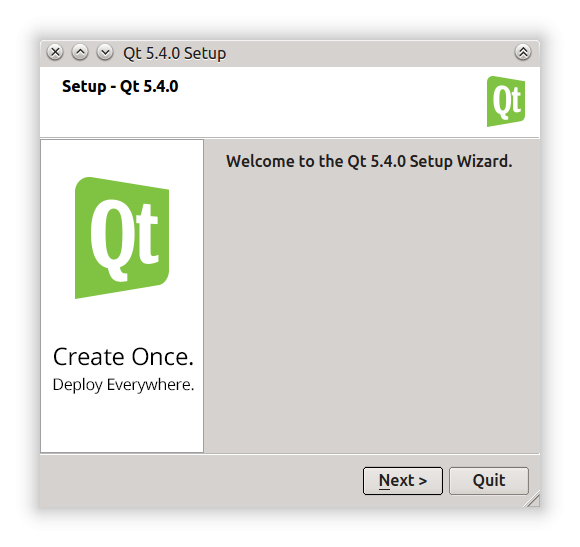
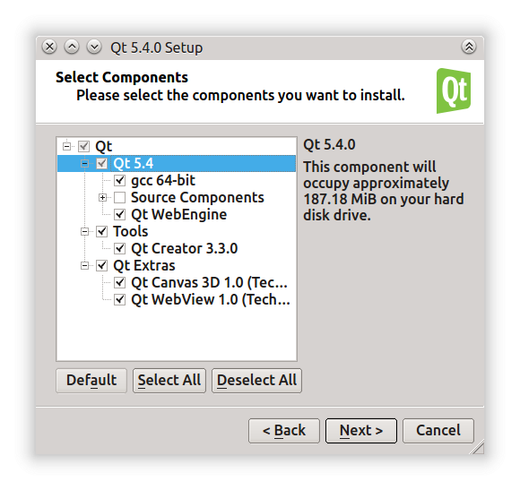
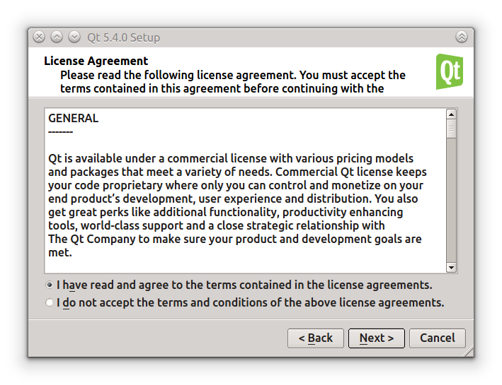
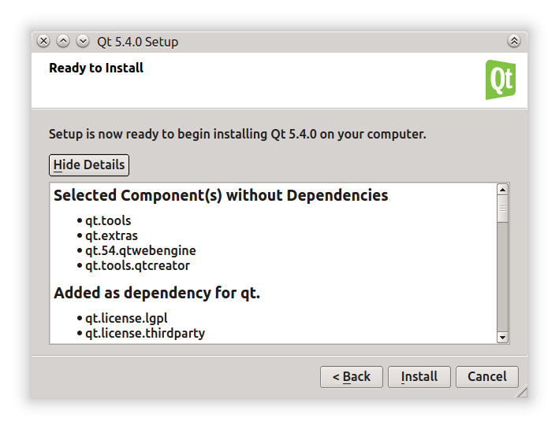

# লিনাক্সে ইন্সটল করা

বর্তমানে উবুন্টু সহ বেশীরভাগ লিনাক্স ডিসট্রিবিউশনে কিউট রানটাইম ইন্সটল করাই থাকে। শুধু ডেভলপমেন্ট হেডার ও লিংকারগুলো ডাউনলোড করে নিলেই চলে। ডেবিয়ান বা উবুন্টু বেজড ডিসট্রিবিউশনে নিচের কমান্ডটি দিলে দরকারী `Qt5` প্যাকেজগুলো ডাউনলোড হয়ে যাবে।

`sudo apt-get install qtbase5-dev qt5-qmake`

অথবা আলাদা করে ডাউনলোড করা ইন্সটলারটি ব্যাবহার করতে চাইলে সেটা ইউজারের হোম কিংবা অন্য কোন লোকেশনে ইন্সটল করতে হবে।

ইন্সটল করার পূর্বে ডাউনলোড করা ফাইলটি এক্সিকিউটেবল করে নেওয়া প্রয়োজন। এজন্য প্রথমে ইন্সটলার ফাইলটি ইউজারের হোমে অথবা এক্সিকিউট করা সম্ভব এমন কোন পার্টিশনে কপি করে নিতে হবে। তারপর নিচের মত কমান্ড দিলেই ইন্সটলার চালু হবে।

```text
chmod +x qt-opensource-linux-x64-5.4.0.run
./qt-opensource-linux-x64-5.4.0.run
```

ইন্সটলার চালু হলে নিচের মত উইন্ডো আসবে। সেখানে `Next` চাপতে হবে।



এরপর ইন্সটল করার পাথ দিতে হবে। ইন্সটল করার ডিরেক্টরী ফাইল ম্যানেজার থেকে লুকিয়ে রাখতে চাইলে ডিরেক্টরীর নামের শেষে একটি ডট \(যেমন `/home/minhaz/.Qt5.4.0`\) ব্যাবহার করা যেতে পারে। কেননা ইন্সটল করার পর ওই ডিরেক্টরী থেকে কোন ফাইল ভুলবশত মুছে গেলে সমস্যা তৈরী হবে।


এরপর কম্পোনেন্টের লিস্ট আসবে। সেখান থেকে দরকারী কম্পোনেন্ট সিলেক্ট করতে হবে। চাইলে `Source Components` ইন্সটল করতে পারেন। তবে স্পেস কম থাকলে স্কিপ করে যেতে পারেন। কিউট ক্রিয়েটর আইডিই যদি আলাদা করে ডাউনলোড করা থাকে তবে এইখানে আনচেক করে দিতে পারেন।



এরপর লাইসেন্স একসেপ্ট করতে হবে।



লাইসেন্স একসেপ্ট করার পর কি কি কমপোনেন্ট ইন্সটল হবে তার লিস্ট আসবে।



`Install` চাপলে আপনার পিসিতে কিউট লাইব্রেরী ও কিউট ক্রিয়েটর আইডিই ইন্সটল হয়ে যাবে।


ইন্সটলের পর `Qt Creator` রান করানোর জন্য প্রম্পট করা হবে।


এবার এপ্লিকেশন মেনুতে বা ড্যাশে `Qt Creator (Opensource)` নামে শর্টকাট চলে আসবে যার অর্থ আপনি লিনাক্সে কিউট ডেভলপমেন্ট শুরু করার জন্য প্রস্তুত।

