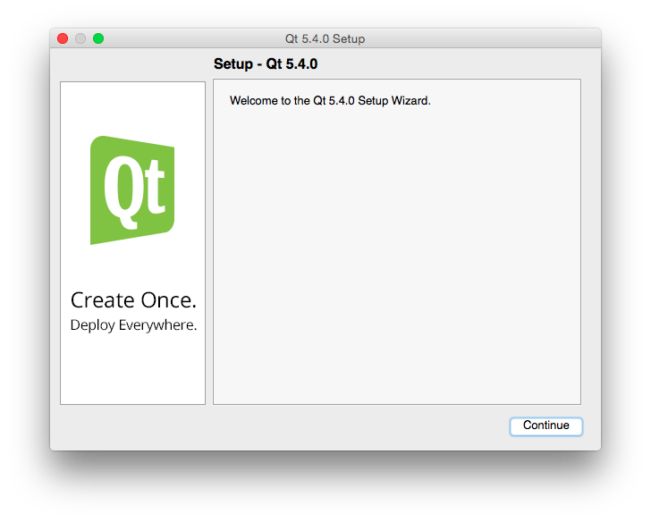
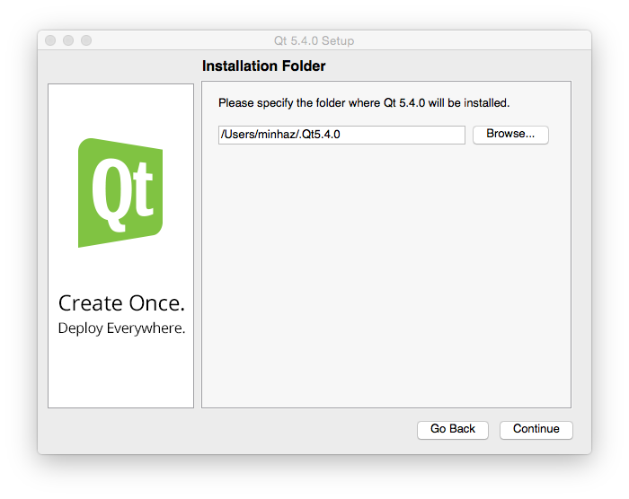

# ম্যাকে কিউট ইন্সটল করা

ম্যাকের জন্য যেকোন এপ্লিকেশন ইন্সটল করা খুবই সহজ হলেও কিউট ইন্সটল করা বেশ কঠিন। ম্যাকের জন্য আমরা `qt-opensource-mac-x64-clang-5.4.0.dmg` ফাইলটি ডাউনলোড করে ব্যাবহার করবো।

প্রথমেই যা করতে হবে তা হল `Xcode Command Line Tools for Mac OS X` ডাউনলোড করতে হবে। কারণ আমরা যে কিউট ভার্শনটি ডাউনলোড করেছি সেটা দিয়ে ডেভলপ করতে হলে `Clang` কম্পাইলার দরকার।

ডাউনলোড করার পর সেটা ইন্সটল করতে হবে। ইন্সটলের পর অবশ্যই `XCode Developer License Agreement` একসেপ্ট করতে হবে। এই কাজটা দুভাবে করা যেতে পারে।

* আপনার ম্যাকে `XCode` ইন্সটল করা থাকলে সেটা রান করান। শুরুতেই লাইসেন্স এগ্রিমেন্ট ডায়ালগ আসবে এবং এডমিন পাসওয়ার্ড দিয়ে লাইসেন্স একসেপ্ট করে নিতে হবে।
* `sudo xcodebuild -license` কমান্ডটি দিয়ে স্ক্রল করতে থাকুন। কনসোলের শেষে পৌছালে লেখার অপশন আসবে, সেখানে `agree` লিখে রিটার্ন চাপুন।

ব্যাস হয়ে গেল। `Xcode Command Line Tools for Mac OS X` কাজ করছে কিনা চেক করার জন্য টার্মিনাল খুলে `clang++` কমান্ডটি লিখে রিটার্ন চাপুন। যদি নিচের মত দেখায় তাহলে বুঝবেন `clang++` টুলটি কিউট ক্রিয়েটরের সাথে ব্যাবহারের জন্য রেডি।

```
minhaz$ clang++
clang: error: no input files
```

এবার `qt-opensource-mac-x64-clang-5.4.0.dmg` ফাইলটি ডাবল ক্লিক করে মাউন্ট করুন। নতুন আসা ভলিউম ওপেন করলে নিচের মত ইন্সটলার আসবে।


ইন্সটলারে ডাবল ক্লিক করলে নিচের মত উইন্ডো আসবে। সেখানে `Continue` চাপতে হবে।



এরপর ইন্সটল করার পাথ দিতে হবে। ইন্সটল করার ডিরেক্টরী ফাইন্ডার থেকে লুকিয়ে রাখতে চাইলে ডিরেক্টরীর নামের আগে একটি ডট (যেমন `/Users/minhaz/.Qt5.4.0`) ব্যাবহার করা যেতে পারে। কেননা ইন্সটল করার পর ওই ডিরেক্টরী থেকে কোন ফাইল ভুলবশত মুছে গেলে সমস্যা তৈরী হবে।


এরপর কম্পোনেন্টের লিস্ট আসবে। সেখান থেকে দরকারী কম্পোনেন্ট সিলেক্ট করতে হবে। চাইলে `Source Components` ইন্সটল করতে পারেন। তবে স্পেস কম থাকলে স্কিপ করে যেতে পারেন। কিউট ক্রিয়েটর আইডিই যদি আলাদা করে ডাউনলোড করা থাকে তবে এইখানে আনচেক করে দিতে পারেন।



এরপর লাইসেন্স একসেপ্ট করার পর কনফার্ম করলে আপনার পিসিতে কিউট লাইব্রেরী ও কিউট ক্রিয়েটর আইডিই ইন্সটল হওয়া শুরু হবে।


ইন্সটল শেষে কিউট ক্রিয়েটর রান করানোর জন্য প্রম্পট করবে। `Done` চাপলে ইন্সটলার বন্ধ হয়ে যাবে। এখন আপনি ভলিউমটি `Eject` করতে পারেন।


রান করানোর পর `Qt Creator` এপটি ডকে পিন করে রাখতে পারেন। সবকিছু ঠিকমত শেষ হওয়ার অর্থ আপনি ম্যাকে কিউট ডেভলপমেন্ট শুরু করার জন্য প্রস্তুত।
