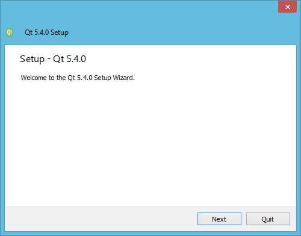
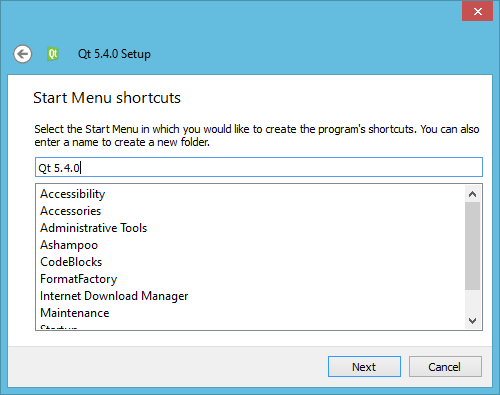
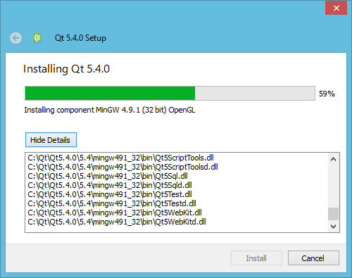

# উইন্ডোজে কিউট ইন্সটল করা

সহজে কিউট ক্রিয়েটরের সাথে ব্যাবহারের জন্য আমরা MinGW বিল্ড ভার্শনটি ব্যাবহার করবো। `qt-opensource-windows-x86-mingw491_opengl-5.4.0` ফাইলটি ডাউনলোড করার পর ডাবল ক্লিক করলে ইন্সটলার চালু হবে।

ইন্সটলার চালু হলে নিচের মত উইন্ডো আসবে। `Next` চাপ দিন।

ডিফল্ট লোকেশনে (`C:\Qt`) ইন্সটল করা যেতে পারে। 

ইন্সটলের কম্পোনেন্টের লিস্ট আসলে সেখান থেকে দরকারী কম্পোনেন্ট সিলেক্ট করুন। চাইলে `Source Components` ইন্সটল করতে পারেন। তবে স্পেস কম থাকলে স্কিপ করে যেতে পারেন। কিউট ক্রিয়েটর আইডিই যদি আলাদা করে ডাউনলোড করা থাকে তবে এইখানে আনচেক করে দিতে পারেন।

লাইসেন্স এগ্রিমেন্ট সিলেক্ট করুন।

স্টার্টআপ মেনুতে শর্টকাটের জন্য ডিফল্ট অপশনটি রেখে দিন। `Next` চাপলে ইন্সটল শুরু হবে।

ইন্সটল চলছে। প্যাকেজটি বেশ বড় হওয়ায় ইন্সটল হতে বেশ কয়েক মিনিট লাগতে পারে।

ইন্সটল শেষে এমন উইন্ডো আসবে এবং `Qt Creator` রান করানোর জন্য প্রম্পট করবে।

ইন্সটলের পর স্টার্ট মেনুতে `Qt Creator (Opensource)` নামে শর্টকাট চলে আসবে যার অর্থ আপনি উইন্ডোজে কিউট ডেভলপমেন্ট শুরু করার জন্য প্রস্তুত।